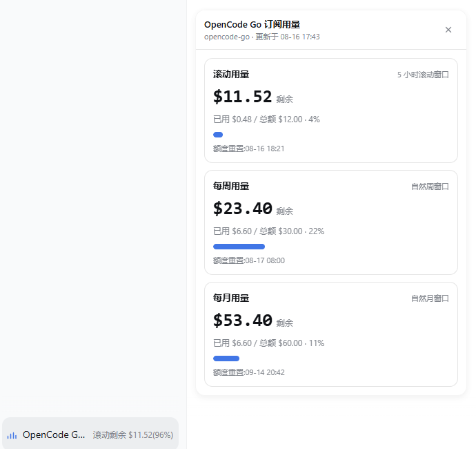

# dsh-plugin-opencode-usage

> OpenCode Go 订阅用量悬浮面板：在 DeepSeek Harness Web GUI **会话窗口左下角**显示订阅额度使用情况。


## 功能

- 在会话窗口左下角注册独立悬浮入口，不占用侧边栏入口，也不放入输入框，避免与其他插件冲突
- 点击弹出悬浮面板，展示 OpenCode Go 订阅的三类额度：

| 窗口 | 官方接口字段 | 默认总额度 |
| --- | --- | --- |
| 滚动用量 | `usage.rolling` | $12（5 小时滚动） |
| 每周用量 | `usage.weekly` | $30 |
| 每月用量 | `usage.monthly` | $15（DeepSeek V4 Pro / V4 Flash） |

- 每张卡片显示：**剩余额度 / 已用额度 / 总额度 / 使用百分比 / 重置时间**
- 面板以入口按钮为锚点：左边缘对齐按钮，底部在按钮上方 12px，随会话窗口/侧边栏变化自动调整
- 打开期间每 60s 自动刷新；支持 `Esc` 与点击面板外部关闭
- API key 只在 Harness host 进程内解析，不会下发浏览器

## 截图



## 工作原理

```text
DSH Web 浏览器
   │  1. 点击会话窗口左下角按钮
   ▼
GET /plugins/opencode-usage/stats
   │
   ▼
DSH Host 插件
   │  2. ctx.credentials.resolve("OPENCODE_GO_API_KEY")
   │  3. GET https://opencode.ai/zen/go/v1/usage
   │     Authorization: Bearer <api-key>
   │  4. percent × limit → used / remaining
   ▼
返回 JSON，由 React 面板渲染
```

官方接口只返回 `percent` 与 `resetsAt`：

```json
{
  "usage": {
    "rolling": { "status": "ok", "percent": 30, "resetsAt": "..." },
    "weekly":  { "status": "ok", "percent": 19, "resetsAt": "..." },
    "monthly": { "status": "ok", "percent": 9,  "resetsAt": "..." }
  }
}
```

插件按 OpenCode Go 官方套餐额度（<https://opencode.ai/docs/go/#usage-limits>）换算：

```text
used      = limit × percent / 100
remaining = limit - used
```

## 目录结构

```text
dsh-plugin-opencode-usage/
├── cordis.patch.yml   # bundle patch: 把插件插入 profile host 组合
├── lib/
│   ├── index.js       # Host 半: 订阅额度 API 查询 + HTTP 路由
│   └── client.js      # Client 半: 会话窗口左下角悬浮按钮 + 面板
├── LICENSE
├── package.json       # dsh.bundle / dsh.client 元数据
└── README.md
```

## 额度口径

以 2026-08-17 官方文档与 usage API 为准：

| 窗口 | 官方套餐窗口额度 | 插件默认 | 是否修改 |
| --- | --- | --- | --- |
| 滚动（5 小时） | $12 | `rolling: 12` | 未变 |
| 每周 | $30 | `weekly: 30` | 未变 |
| 每月（整体） | $60 | — | 未变 |
| 每月（v4p/v4f 模型包含用量） | $15 | `monthly: 15` | 已改为 $15 |

交叉验证：官方 usage API 当前约 `rolling 18% / weekly 7% / monthly 11%`，
按 `12 / 30 / 15` 换算后与本地 DSH 会话日志估算的 OpenCode Go 实际消费
基本一致；若把 monthly 按 $60 换算会明显偏大。

## 安装

```sh
cd /path/to/your/workspace
dsh plugin --profile web add ./dsh-plugin-opencode-usage
```

也可以安装已发布的 GitHub 仓库（`prepare` 无构建步骤，可直接引用）：

```sh
dsh plugin --profile web add github:jiekesu967/dsh-plugin-opencode-usage
```

安装后 `dsh plugin` 会自动写入 web profile 的 `dependencies`，并把
`dsh-plugin-opencode-usage` 追加到 `dsh.profile.bundles`。重启 `dsh web`
并刷新页面后，会话窗口左下角会出现独立的 “OpenCode Go 用量” 悬浮入口。

## 配置

在 profile 的 `cordis.patch.yml` 覆盖 `opencode-usage` 条目：

```yaml
- id: opencode-usage
  config:
    # Harness credentials 文件中保存 API key 的变量名
    credentialRef: OPENCODE_GO_API_KEY

    # OpenCode Go 订阅接口
    apiBaseUrl: https://opencode.ai/zen/go/v1

    # 货币符号
    currency: "$"

    # host 成功结果缓存时间
    cacheMs: 30000

    # 官方调整套餐额度时，改这里即可，无需改代码
    limits:
      rolling: 12
      weekly: 30
      monthly: 60
```

### 凭据

在 `~/.dsh/.credentials.yaml` 中确认存在：

```yaml
OPENCODE_GO_API_KEY: sk-...
```

也可以通过 DSH Web 的 Models / Credentials 设置页写入。

## 入口与面板定位规则

入口注册在 `shell.overlay`，绝对定位于 AppFrame 的**会话中心列左下角**：

1. 按钮：会话中心列左侧内边距 `12px`、底部 `16px`
2. 面板：左边缘与按钮对齐，底部位于按钮上方 `12px`
3. 面板宽度最大 `392px`，右侧/顶部超出视口时自动回退
4. `ResizeObserver` 监听会话中心列，侧边栏展开/收起、详情面板开关、窗口缩放时实时跟随

## 已知限制

- 官方 usage 接口只返回百分比，不返回绝对金额；绝对额度由 `limits` 配置计算
- OpenCode Go 整体套餐上限仍是每月 $60，但 v4p/v4f 月度包含用量已调为 $15；若官方再次调整，需要同步更新 `limits` 配置
- 仅适用于 `web` profile；`headless` 下不注册路由

## License

MIT
